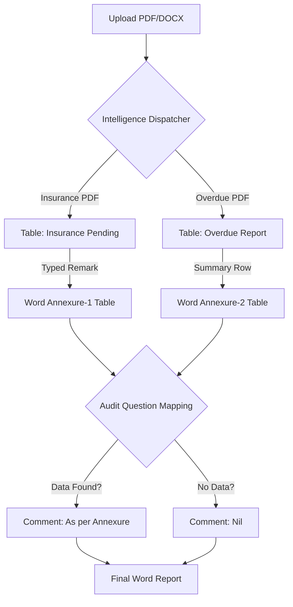

# Audit Report Generator: Enhanced Demo & Workflow

This document explains the "Intelligence Mapping" system that automatically connects your raw PDF data to the formal Word Audit Report.

---

## 1. Automated Extraction Phase
When you upload files, the system distinguishes between the **Audit Template** and **Supporting Reports**:
*   **Audit Template (DOCX):** Scanned for structure and converted to a "Skeleton Excel" for reference.
*   **Branch Reports (PDF):** Specialized extractors (Cash, Insurance, Overdue, Limit, Trial Balance) convert complex PDF layouts into clean tables.

---

## 2. Dynamic Annexure Population
Unlike simple copy-pasting, the system uses **Dynamic Looping** to build your Annexures in the Word document.

### Example: Annexure -1 (Insurance Pending)
If the system extracts 5 rows from your "Insurance Pending" PDF:
1.  It automatically populates the table in the Word file.
2.  It converts **Limit Amount (INR)** into **Rs. In Lacs** (e.g., 23,000,000 becomes 230.00).
3.  It preserves your **Remarks** typed in the UI as the "Reply of Branch".

---

## 3. Intelligent Question Mapping
The system "identifies" which audit question relates to which data sheet. 

### A. Auto-Switching Comments
The "Auditor's Comment" column in the main audit table is now dynamic:
*   **Question 5 (Insurance):** 
    *   If issues are found in the PDF → Shows **"As per Annexure-1"**.
    *   If NO issues are found → Automatically switches to **"Nil"**.
*   **Question 10 (Potential NPA):**
    *   If summary rows exist → Shows **"As per Annexure-2"**.
    *   Otherwise → Automatically switches to **"Nil"**.

### B. Remarks Passthrough
If you have a sheet named "Cash Credit" or "Bills Purchase" and you type a **Remark** in the UI:
1.  The system ignores the generic disclaimer (e.g., "Not applicable...").
2.  It takes **your exact typed text** and places it directly into the main audit report table.

---

## 4. Visual Summary of Data Flow

---

## Summary of Benefits
1.  **Context Awareness:** The system knows that "Question 5" needs "Annexure 1" data.
2.  **Smart Formatting:** Automatic conversion of currencies and units (INR to Lacs).
3.  **Manual Override:** Typing a Remark in the Excel view always takes priority over hardcoded template text.
4.  **Zero Duplication:** You only type your observation once; it appears in both the Master Excel and the Word Audit Report.
